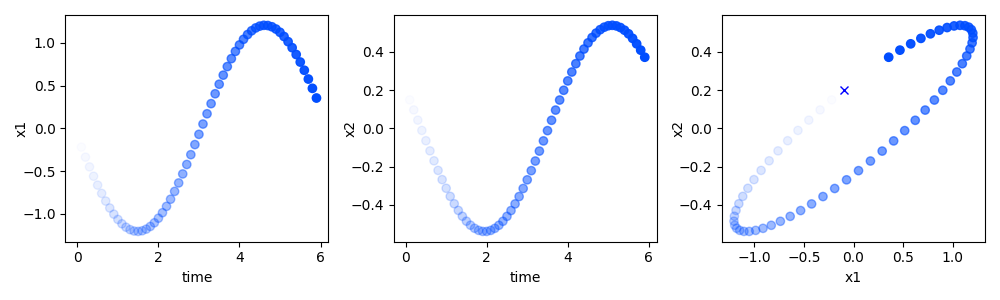
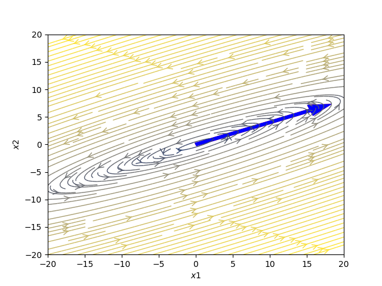
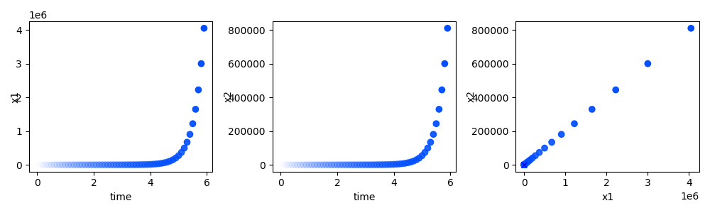
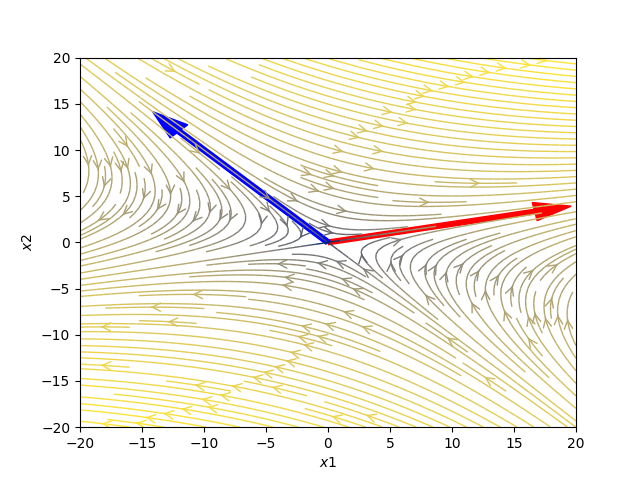
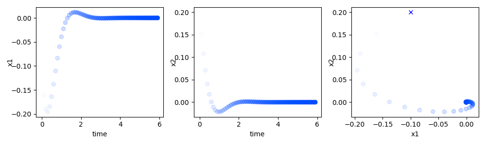
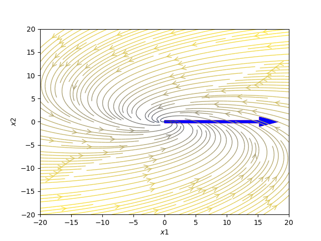

# Forward Euler Integration

An ordinary differential equation can be simulated by modeling time 
as a discrete list of steps t0, t1, t2, ti, tn, such that ti = t(i-1) + dt, where i = (0, 1, 2, ..., n).
The following integration method called **Forward Euler Integration**.

The differential equation is the relation of x change to time change.
It is supposed that for 1 dimensional linear deterministic dynamical systems

```markdown
x' = ax
```

in that case:

```markdown
dx/dt = x'

dx = x'dt

xi - x(i - 1) = x'dt

xi = x(i - 1) + x'dt
```


## 2 dimensional ordinary differential equation

```markdown
x1' = a00 * x1 + a01 * x2
x2' = a10 * x1 + a11 * x2
```
```markdown

A = [[a00, a01], [a10, a11]]

[x1', x2']T = [[a00-l, a01], [a10, a11-l]][x1, x2]T
det([[a00-l, a01], [a10, a11-l]]) = 0

(a00-l) * (a11-l) - (a01) * (a10) = 0
l1 = c1
l2 = c2
```
By varying matrix A values, eigenvalues changes:

a) eigenvalues l1 and l2 are imaginary numbers



b) eigenvalues l1 and l2 are real numbers



c) eigenvalues l1 and l2 are complex numbers

