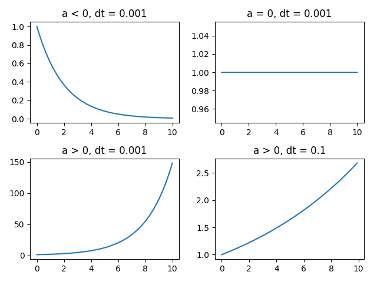

# Forward Euler Integration

An ordinary differential equation can be simulated by modeling time 
as a discrete list of steps t0, t1, t2, ti, tn, such that ti = t(i-1) + dt, where i = (0, 1, 2, ..., n).
The following integration method called **Forward Euler Integration**.

The differential equation is the relation of x change to time change.
It is supposed that for 1 dimensional linear deterministic dynamical systems

```markdown
x' = ax
```

in that case:

```markdown
dx/dt = x'

dx = x'dt

xi - x(i - 1) = x'dt

xi = x(i - 1) + x'dt
```



